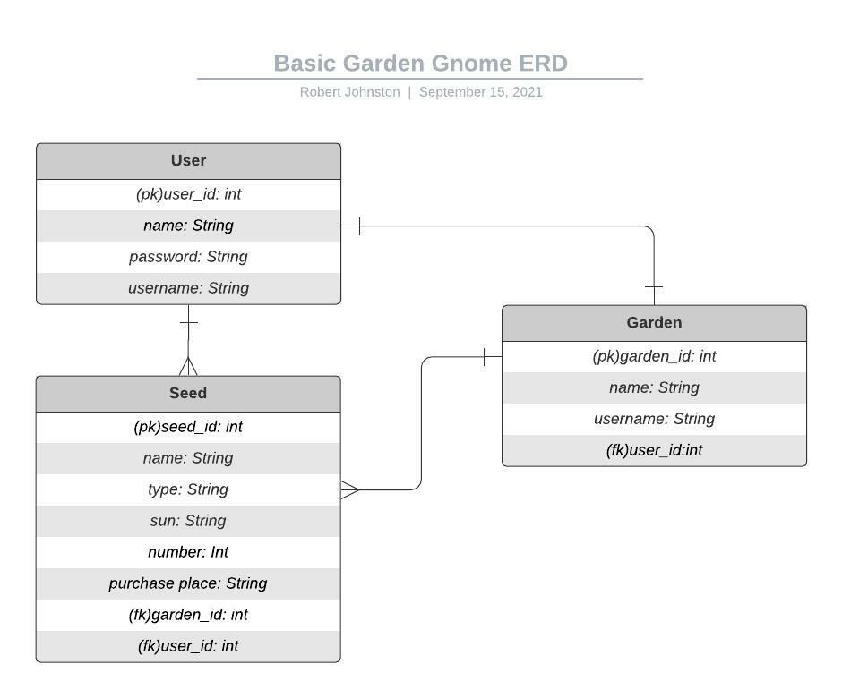

# Garden Gnome: A Description
Garden Gnome is an application that lets a user sign in and track the seeds that they have.  Seeds can be added, updated, and removed.  The user can see what seeds they have and what seeds have been planted in the garden.  The user can see the information about each seed, like type, planting season, and sun requirements.  The user can also mark seeds as favorite and add additional notes about each seed.
# LOCAL SET UP
# Prerequisites
- You should have Python v3+, POstgreSQL, and Pipenv installed.
Here is a good place to start to find out how:
- Django Installation [DJANGO INSTALLATION INSTRUCTIONS](https://docs.djangoproject.com/en/3.2/topics/install/)
# Installation Instructions
- Clone this project into your virtual environment
- Make sure you are running your virtual environment with ``pipenv shell``
- Install gunicorn to your pip environment with ``pipenv install gunicorn``
- Install dependencies with ``pipenv install django-rest-auth django-cors-headers python-dotenv dj-database-url`` in your virtual environment folder
- Create a psql database
  - Run your database with ``psql -U postgres``
  - Create database with ``CREATE DATABASE "database-name"``
- Add database to ``.env`` file using the key ``DB_NAME_DEV``
- Add a secret key to ``.env`` with key ``SECRET``
  - Try this for [SECRET KEY](https://djecrety.ir/) value.
- Run ``python manage.py makemigrations`` and ``python manage.py migrate`` to make sure all migrations have occured.
- Run ``python manage.py runserver`` to spin up the local server.

# IMPORTANT LINKS
- Garden Gnome Deployed Client [DEPLOYED CLIENT](https://robert-a-johnston.github.io/garden-gnome-client/)
- Garden Gnome Client Repo [CLIENT REPO](https://github.com/robert-a-johnston/garden-gnome-client)
- Garden Gnome API Deployed [DEPLOYED API](https://garden-gnome-api.herokuapp.com)
# PLANNING STORY
The developer started planning by looking for a problem that needed to be solved.  There was a drawer of plant seeds but the developer did not know what exactly was in the drawer.  They also wanted to keep track of the information about each type of seed and if they were planted in the garden currently.
In order to fix this problem the developer decided to create a digital seed repository. User stories were created. The developer looked for the most basic functionality of the seed that would address as many of the user stories as possible.  Then the ERD diagram and wire-frames were created.  The developer decided that the best type of data-base long term would be a SQL database and decided to use Django and postgresSQL for the server, and the React framework for the client.  The developer set a time table that they felt was realistic to complete the project in the time alloted.  The developer then wrote sudo-code to determine the flow of data and how data would be retrieved.  Then the developer began writing code.
# ERD

# USER ROUTE PATHS AND METHODS
|HTTP METHOD |URL PATH        |RESULT           |ACTION |
|:-----------|:---------------|:----------------|-------|
|GET         |/sign-in        |get one user     |sign-in|
|seed        |/sign-up        |create user      |create |
|PATCH       |/change-password|update password  |update |
|DELETE      |/sign-out       |sign-out         |destroy |
# SEED ROUTE PATHS AND METHODS
|HTTP METHOD |URL PATH        |RESULT           |ACTION |
|:-----------|:---------------|:----------------|-------|
|GET         |/seeds/         |list of all seeds|index or list|
|GET         |/seed/<<int:pk>>/ |read single seed |show |
|POST        |/seeds/         |create seed      |create |
|PATCH       |/seed/<<int:pk>>/ |update seed      |update |
|DELETE      |/seed/<<int:pk>>/ |delete seed      |destroy |

# TECHNOLOGIES USED
- Python
- Django
- postgresSQL
# FUTURE DEVELOPMENT
- Add additional tables linking garden table to seed and user tables.
